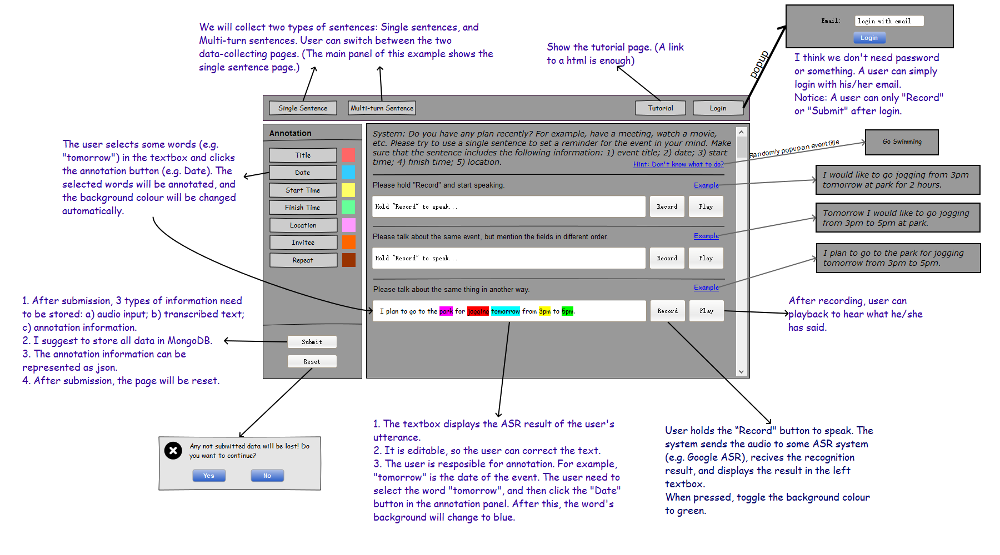
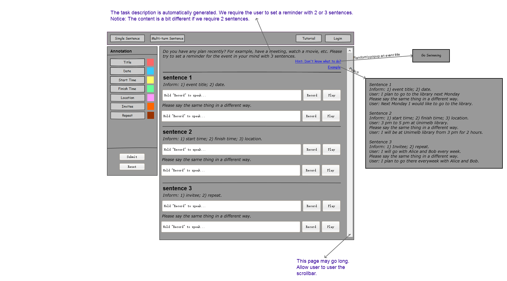

# Basic Architecture

The system is built with a traditional client/server architecture. On the client's side, almost all the code is written in Flash; On the server's side, we use Python scripts to process uploaded data with a technique called CGI.

The workflow is as follows:

1. User open the website (written in Flash).
2. User record his/her speech according to the task descrption.
3. The audio data is posted to the server immediately after recorded (even the user finally does not submit the data).
4. On the server's side, a python script receives the posted audio data, stores it on disk, makes recognition, and returns the ASR result.
5. On the client's side, the browser receives the ASR result and displays it.
6. User makes annotations.
7. User repeats steps 2-6 for other sentences.
8. User click 'submit'. The Flash code extracts the annotations information, and handles it to the server.
9. The server uses another Python script to process the annotation data, storing it into MongoDB. The server also returns how many dialogs are totally collected from the current user.
10. The client's side shows a thank you message, and finishes the session.

# File List

1. ./idc.swf, ./index.html: The main webpage and the corresponding Flash file.
2. ./cgi-bin/*: The python scripts that run on the server. Currently there are two simple but useful scripts, handling audio and annotation data respectively.
3. ./src/*: These are the source codes of the Flash project.
    - ./src/idc.fla: The main project file, which should be opened with Flash CS5 or something in Windows.
    - ./src/Login.as, MsgBox.as, Thankyou.as: Packages of prompting windows.
    - ./src/org/*: Packages download from other sources, which are used to record audio and generate wav files.

# Record & Play

The code for recording and playing audio is public available. [This example](http://bbs.9ria.com/thread-236391-1-1.html) shows how to use it.

# Upload Audio

The code for uploading audio in Flash is the following fragment:

```as3
    // Warning: the length of fileName MUST be 16 !!
    function uploadAudio(fileName:String, audio:ByteArray){
        	var uploadBytes:ByteArray=new ByteArray(); 
        	uploadBytes.writeUTFBytes(fileName);
        	uploadBytes.writeBytes(audio);
        	//trace(uploadBytes.length);
        	var urlreq:URLRequest = new URLRequest(audioProcessURL);
        	urlreq.method = URLRequestMethod.POST; 	
        	var urlvars:URLVariables = new URLVariables(); 
        	urlreq.data = uploadBytes;          
        	loader = new URLLoader (urlreq); 
        	loader.addEventListener(Event.COMPLETE, uploadAudioCompleted); 
        	loader.dataFormat = URLLoaderDataFormat.TEXT; 
        	loader.load(urlreq);
    }
```

The fileName is a UTF string with length 16 (16 bytes). The simple protocal here is that the first 16 bytes are the file name, while the remaining is the wav file. If urlreq.data is a ByteArray, it will be sent as binary data ([see this](http://help.adobe.com/en_US/FlashPlatform/reference/actionscript/3/flash/net/URLRequest.html#data) "If the object is a URLVariables object and the method is POST..." we will use this later when upload annotations).

The following Python scripts (process_audio.py) reads the file name (16 bytes), the audio file, and then writes the audio data on disk.

```python
    fileName = str(sys.stdin.read(16))
    fileName = fileName.decode("utf-8")
    
    audio = sys.stdin.read()
    with open('/idc_data/'+fileName+'.wav', 'wb') as f:
        f.write(audio)
```

After this, the Python script will return the ASR result by using another available package. This part is quite straight forward.

# Annotation Format

The annotation format is character-based. The following is an example:

```
    tomorrow I would like to go jogging from 3 p.m. to 5 p.m. at Park
    22222222000000000000000001111111111000000333333300044444405555555
```

The numbers in the second line indicates the annotation of the corresponding character as follows:
1. Event title
2. Date
3. Start time
4. Finish time
5. Location
6. Invitee
7. Repeat

The annotation is achieved by setting/getting the font color in the TextArea, which is not difficult in Flash.

The full annotation data also includes other infomation, such as the email of the client, the time of submission, etc. The following is a detailed description of the annotation format:

```
    {'email': email, \\ email address of the client. e.g. "linaiqi@mail2.sysu.edu.cn"
     'sent1': {'text': sent1, \\ the raw text. e.g. "tomorrow I would like to go jogging from 3 p.m. to 5 p.m. at Park"
               'anno': sent_anno1, \\ the annotation. e.g. "22222222000000000000000001111111111000000333333300044444405555555"
               'audioFiles': audioFiles1 \\ the file names of the corresponding wav files. notice that a sentence may have multiple audio files, seperated by '//'. For example "linaiq1490863783//linaiq1490863759//" (which means the user had recorded the sentence twice)
              },
     'sent2': {'text': sent2, 'anno': sent_anno2, 'audioFiles': audioFiles2},
     'sent3': {'text': sent3, 'anno': sent_anno3, 'audioFiles': audioFiles3},
     'date': dt, \\ time of submission
     'task': task \\ task description. e.g. "1) event title; 2) date; 3) start time; 4) finish time; 5) location; 6) invitee; 7) repeat;"
    }
```

# Upload Annotations

The following code shows how to upload annotations on the server's side, which is similar to that of uploading audio. 

```
    function uploadAnnotation(){
    	var urlreq:URLRequest = new URLRequest(annotationProcessURL);
    	urlreq.method = URLRequestMethod.POST; 	
    	var urlvars:URLVariables = new URLVariables(); 
    	urlvars.sent1 = resptxt1.text;
    	urlvars.sent_anno1 = genAnnotation(resptxt1);
    	urlvars.sent2 = resptxt2.text;
    	urlvars.sent_anno2 = genAnnotation(resptxt2);
    	urlvars.sent3 = resptxt3.text;
    	urlvars.sent_anno3 = genAnnotation(resptxt3);
    	urlvars.audioFiles1 = audioFiles1;
    	urlvars.audioFiles2 = audioFiles2;
    	urlvars.audioFiles3 = audioFiles3;
    	urlvars.task = task;
    	urlvars.email = email;
    	urlreq.data = urlvars;          
    	loader = new URLLoader (urlreq); 
    	loader.addEventListener(Event.COMPLETE, uploadAnnotationCompleted); 
    	loader.dataFormat = URLLoaderDataFormat.TEXT; 
    	allBlock();
    	loader.load(urlreq);
    }
```

The python script (process_single_anno.py) receives, the annotation data, stores it into MongoDB, and returns the total number of dialogs collected by the current user.

```python
    form = cgi.FieldStorage()
    
    sent1 = form.getvalue('sent1')
    sent_anno1 = form.getvalue('sent_anno1')
    sent2 = form.getvalue('sent2')
    sent_anno2 = form.getvalue('sent_anno2')
    sent3 = form.getvalue('sent3')
    sent_anno3 = form.getvalue('sent_anno3')
    email = form.getvalue('email')
    audioFiles1 = form.getvalue('audioFiles1')
    audioFiles2 = form.getvalue('audioFiles2')
    audioFiles3 = form.getvalue('audioFiles3')
    task = form.getvalue('task')
    dt = datetime.datetime.utcnow()
    
    logger.debug("Receive from %s" % email)
    
    client = MongoClient()
    db = client['idc']
    coll = db['single']
    coll.insert({'email': email,
               'sent1': {'text': sent1, 'anno': sent_anno1, 'audioFiles': audioFiles1},
               'sent2': {'text': sent2, 'anno': sent_anno2, 'audioFiles': audioFiles2},
               'sent3': {'text': sent3, 'anno': sent_anno3, 'audioFiles': audioFiles3},
               'date': dt,
               'task': task
            })
    
    logger.debug("Write to mongodb")
    cnt = coll.find({'email': email}).count()
```

# Check the Data

The audio data is saved in the path '/idc_data' on the server. The annotation is saved in MongoDB. The DB name is 'idc', and the collecton name is 'single'.

# TODO

The system for collecting single sentences is basically finished. We can spend some time to test the current implementation, and then move on to implement the multi-turn collecting system. The following to pictures are the prototype UI.

